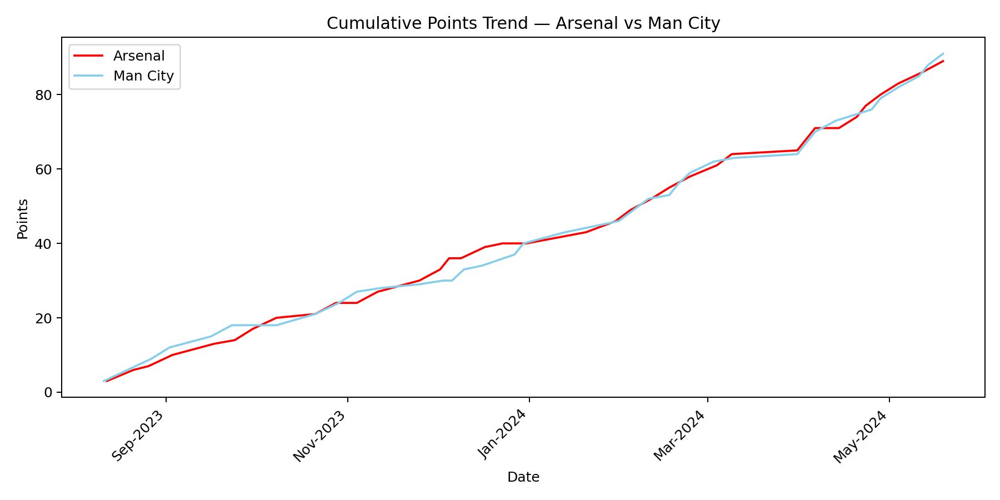

# Premier League 2023–24 — Season Analysis (EDA)

**Tech Stack:** Python, Pandas, Matplotlib, Seaborn  

This project performs an **exploratory data analysis (EDA)** of the 2023–24 Premier League season.  
It highlights team performance, goals scored/conceded, and home vs away consistency — all through clear visualizations.

---

## Project Structure
```bash
premier-league-analysis/
├── data/
│   ├── raw/           # season matches data (CSV)
│   └── processed/     # optional derived tables
├── reports/
│   └── figures/       # saved plots
├── notebooks/         # Jupyter notebooks for analysis
└── requirements.txt
```
## Quickstart 
#### 1. Create and activate virtual environment
python3 -m venv .venv
source .venv/bin/activate

#### 2. Install dependencies
pip install -r requirements.txt

#### 3. Download season data (already included in this repo):
##### data/raw/matches.csv

#### 4. Run EDA (via notebook or script)
jupyter notebook notebooks/01_eda.ipynb

## Results & Insights 

### Standings — Points by Team
	•	Man City and Arsenal lead the table with >80 points each.
	•	Sheffield United and Burnley are far below, clearly in relegation battle.
	•	Man City has the best goal difference (+60), followed closely by Arsenal and Liverpool.
	•	Arsenal stays very consistent home and away — a sign of a strong contender.

### Goals For vs Goals Against
	•	City, Arsenal and Liverpool dominate offensively.
	•	Sheffield United shows the weakest defense, conceding over 90 goals.

### Home vs Away Consistency
	•	Man City and Liverpool are almost unbeatable at home (>2.4 PPG).
	•	Arsenal keeps performance balanced home and away — crucial for a title race.


### Goals Per Shot (Efficiency)
	•	Arsenal is slightly less efficient than City in turning shots into goals.
	•	Improving finishing could help convert tight matches into wins.

### Discipline (Fouls & cards)
	•	Arsenal commits a similar number of fouls to most top teams, but reducing unnecessary yellow cards could help maintain key players available in decisive fixtures. (or maybe there is a bias from the referees, idk, could be.)

### Arsenal — Key Insight

Arsenal finished 2nd, only **2 points behind Manchester City**.

- **Goals For:** Practically identical to Manchester City, confirming Arsenal's attacking output is at a title-winning level.
- **Goals Against:** 5 more goals conceded than Manchester City, highlighting a defensive gap that could be decisive.
- **Away Performance:** Arsenal averaged ~0.3 fewer points per away match compared to City — a key difference in a close title race.
- **Shot Efficiency:** Slightly below City’s, meaning there is room to improve finishing. (or buying another striker)
- **Form:** The late-season drop-off cost them the title.

**Actionable Recommendation:**  
Arsenal should focus on:
	•	Defensive solidity, especially away from home
	•	Better conversion rate (turn more shots into goals)
	•	Keeping momentum in the last 5–7 matches of the season

Even 1–2 additional wins in away fixtures could have turned this into a title-winning season.

### Arsenal vs Champion (Man City)


Arsenal matches City offensively but concedes slightly more goals and loses points in away games.
Closing this gap — especially in away matches and in the final weeks — is the key to taking the next step.

### Points Trend — Arsenal vs Man City


- Arsenal stayed neck-and-neck with City for most of the season.
- The small gap opened in the last 5–7 matches — this dip was decisive in the title race.